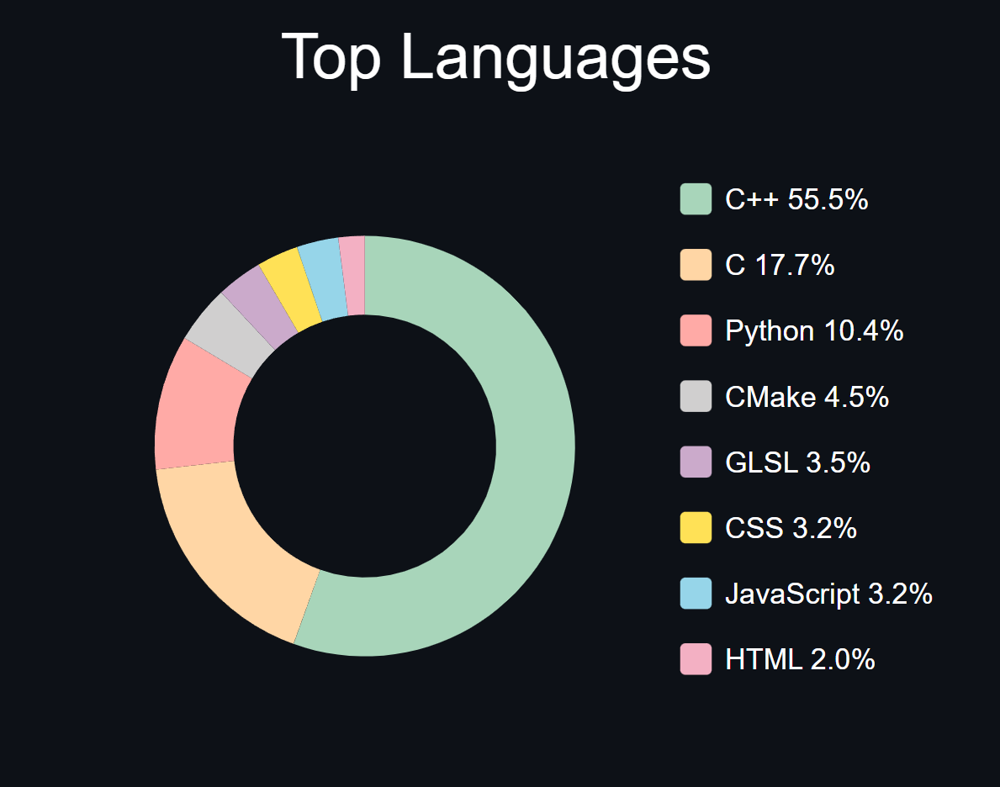

# Github Top Languages

Generate a top languages chart for your GitHub profile that you can embed in a README or website.



## Features
- Generates a donut chart of your top 8 programming languages.
- Automatically fetches all your owned GitHub repositories.
- Ignores forks and optionally specific repositories.
- Uses caching to reduce API calls and improve performance.

## Usage

### Markdown (For READMEs)
```bash

```

### HTML (For Websites)
```html

```
<br/>


## Deployment & Configuration

### Prerequisites
- Node.js 18+
- (Optional) Vercel or other Node.js hosting

### Installation
```bash
git clone https://github.com/masonlet/github-top-languages.git
cd github-top-languages
npm install
```

### Configuration
Copy `.env.example` to `.env`, and update the variables.
- `GITHUB_USERNAME`: User to fetch repositories and statistics.
- `IGNORED_REPOS`: Optional repos you don't want counted in your chart.

### Running Locally
```bash
npm run dev
# Your endpoint will be available at https://localhost:3000/api/languages (or your configured port)
```

### Deployment
- **Vercel**: Simply import your repo and deploy. The default endpoint is /api/languages

<br/>


## License
MIT License - see [LICENSE](./LICENSE) for details.
