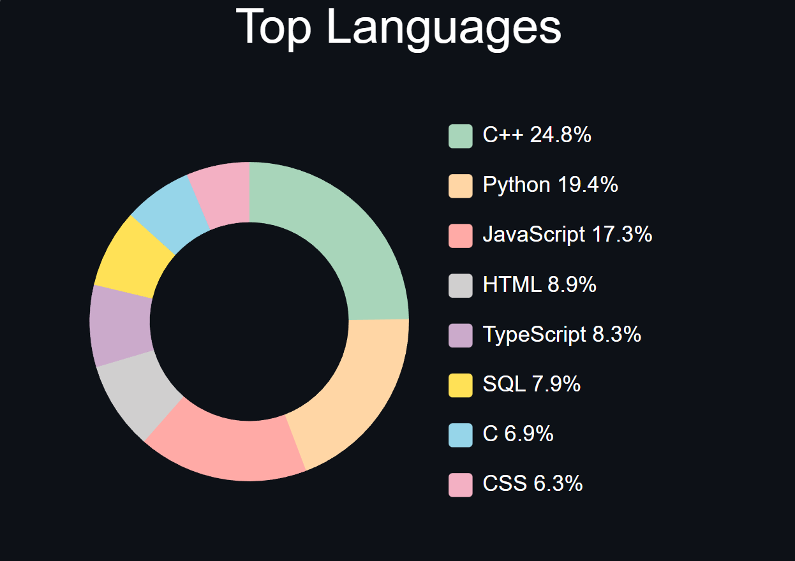

# Github Top Languages

Generate a top languages chart for your GitHub profile that you can embed in a README or website.

[](https://github.com/masonlet/github-top-languages/actions/workflows/tests.yml)
[](./LICENSE)



## Table of Contents
- [Features](#features)
- [Usage](#usage)
- [Deployment & Configuration](#deployment--configuration)
- [License](#license)

## Features
- Generates a donut chart of your top programming languages (up to 16).
- **Customizable:** Control the title, size, theme, and number of languages displayed.
    - **Theming**: Supports `default`, `light`, and `dark` themes.
    - **Custom Colours**: Set background (`bg`), text (`text`), and individual language colours (`c1`-`c16`) via query parameters. 
- **Dynamic Layout:** The legend automatically shifts to a **two-column layout** when displaying 9 or more languages.
- Automatically fetches all your public GitHub repositories.
- Ignores forks and optionally specific repositories (`IGNORED_REPOS`).
- Uses **hourly caching** to reduce API calls and improve performance.

## Usage

### Markdown (For READMEs)
```markdown

```

### HTML (For Websites)
```html

```

### Customization Options
Append these query parameters to the URL to customize the look and data of your chart:

| Parameter | Type | Description | Default | Example |
| :--- | :--- | :--- | :--- | :--- |
| `theme` | String | Sets the colour scheme. Available options: `default`, `light`, `dark`. | `default` | `?theme=dark` |
| `title` | String | Sets a custom title for the chart. | `Top Languages` | `?title=My%20Code%20Stack` | 
| `hide_title` | Boolean | Hides the chart title completely. | `false` | `?hide_title=true` |
| `count` | Number | Sets the maximum number of languages to display. Max is **16**. | `8` | `?count=10` |
| `width` | Number | Sets the width of the SVG in pixels. | `400` | `?width=500` |
| `height` | Number | Sets the height of the SVG in pixels. | `300` | `?height=350` |
| `bg` | String | Sets the chart background colour. Accepts hex (`ffffff`) or theme names (`dark`, `light`). | `default` | `?bg=dark` |
| `text` | String | Sets the chart text colour. Accepts hex (`ffffff`). | `#000000` | `?text=ffffff` |
| `c1`-`c16` | String | Sets individual colours for languages 1-16. Accepts hex codes. | Auto-assigned | `?c1=ff0000&c2=00ff00` |
| `test` | Boolean | Uses samples data instead of fetching from GitHub API. | `false` | `?test=true` |
| `stroke` | Boolean | Adds an outline stroke to chart segments. | `false` | `?stroke=true` |

#### Example URL
To get 10 languages, a dark theme, and a custom title:
```markdown

```

<br/>


## Deployment & Configuration

### Prerequisites
- Node.js 18+
- (Optional) Vercel or other Node.js hosting

### Installation
```bash
git clone https://github.com/masonlet/github-top-languages.git
cd github-top-languages
npm install
```

### Configuration
Copy `.env.example` to `.env`, and update the variables.
- `GITHUB_USERNAME`: User to fetch repositories and statistics.
- `IGNORED_REPOS`: Optional repos you don't want counted in your chart.

### Running Locally
```bash
vercel dev
# Your endpoint will be available at https://localhost:3000/api/languages (or your configured port)
```

### Deployment
- **Vercel**: Simply import your repo and deploy. The default endpoint is /api/languages

<br/>


## License
MIT License - see [LICENSE](./LICENSE) for details.
