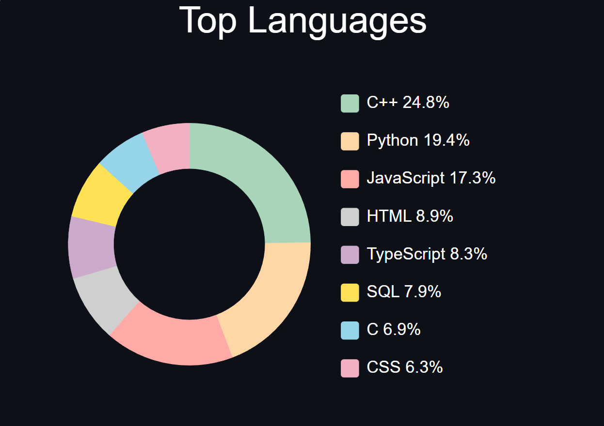
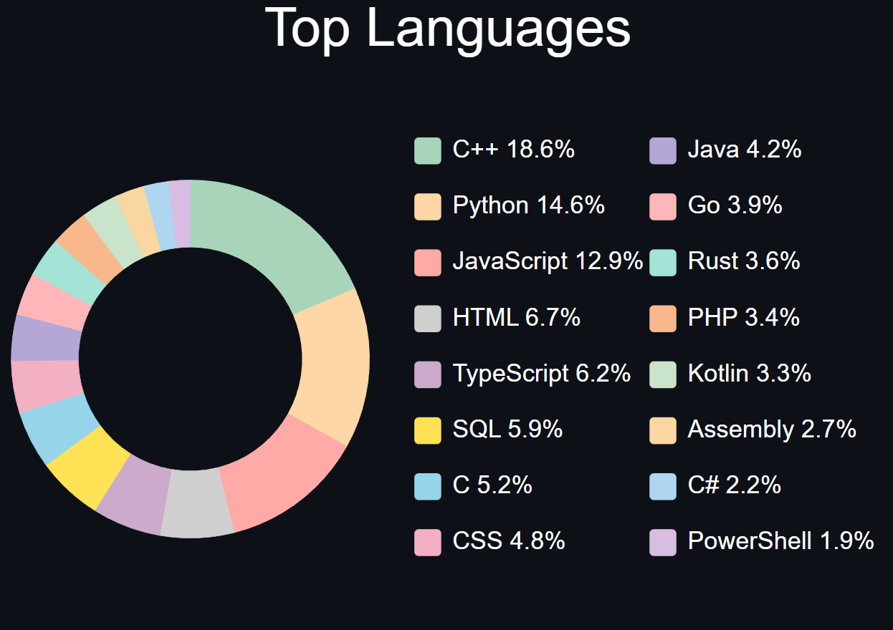
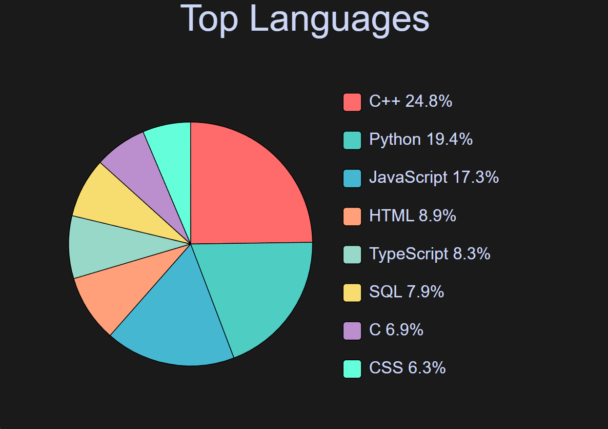
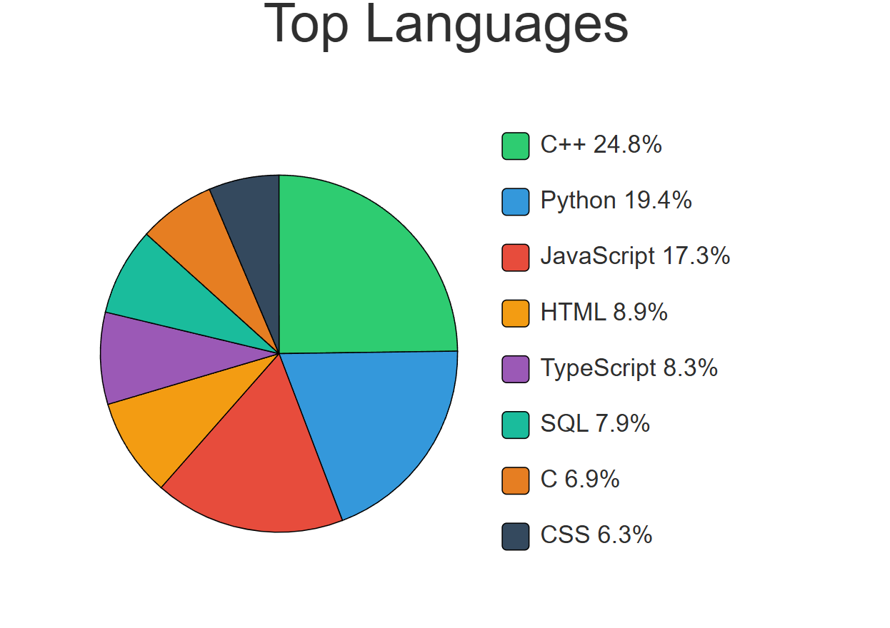
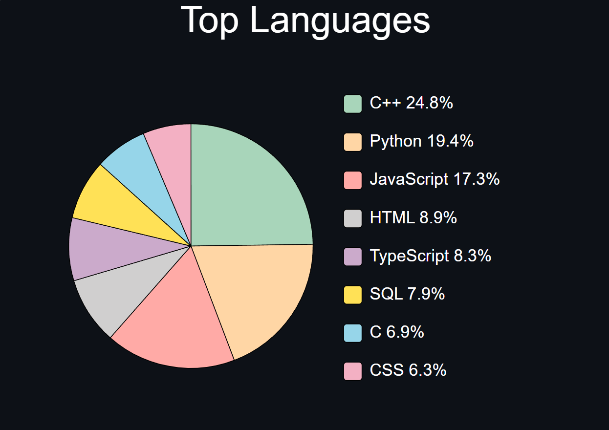

# Github Top Languages

Generate a top languages chart for your GitHub profile that you can embed in a README or website.

[](https://github.com/masonlet/github-top-languages/actions/workflows/tests.yml)
[](./LICENSE)



<details>
  <summary>More Examples</summary>

  **16 Languages**
  

  **Dark Theme**
  

  **Light Theme**
  

  **Default Theme**
  
</details>

## Table of Contents
- [Features](#features)
- [Usage](#usage)
- [Deployment & Configuration](#deployment--configuration)
- [License](#license)

## Features
- Generates a donut chart of your top programming languages (up to 16).
- **Customizable:** Control the title, size, theme, and number of languages displayed.
    - **Theming**: Supports `default`, `light`, and `dark` themes.
    - **Custom Colours**: Set background (`bg`), text (`text`), and individual language colours (`c1`-`c16`) via query parameters. 
- **Dynamic Layout:** The legend automatically shifts to a **two-column layout** when displaying 9 or more languages.
- Automatically fetches all your public GitHub repositories.
- Ignores forks and optionally specific repositories (`IGNORED_REPOS`).
- Uses **hourly caching** to reduce API calls and improve performance.

## Usage

### Markdown (For READMEs)
```markdown

```

### HTML (For Websites)
```html

```

### Customization Options
Append these query parameters to the URL to customize the look and data of your chart:

| Parameter    | Type    | Description | Default | Example |
| :---         | :---    | :--- | :--- | :--- |
| `theme`      | String  | Sets the colour scheme. Available options: `default`, `light`, `dark`. | `default`  | `?theme=dark` |
| `type`       | String  | Sets the chart type. Available options: `donut`, `pie`.                | `donut`    | `?type=pie`   |
| `title`      | String  | Sets a custom title for the chart.                   | `Top Languages` | `?title=My%20Code%20Stack` |
| `hide_title` | Boolean | Hides the chart title completely.                    | `false`         | `?hide_title=true`         |
| `text`       | String  | Sets the chart text colour. Accepts hex (`ffffff`).  | `#000000`       | `?text=ffffff`             |
| `bg`         | String  | Sets the chart background colour. Accepts hex (`ffffff`) or theme names (`dark`). | `default` | `?bg=dark` |
| `c1`-`c16`   | String  | Sets individual colours for languages 1-16. Accepts hex codes.  | Auto-assigned | `?c1=ff0000&c2=00ff00` |
| `count`      | Number  | Sets the maximum number of languages to display. Max is **16**. | `8`           | `?count=10`            |
| `width`      | Number  | Sets the width of the SVG in pixels.                            | `400`         | `?width=500`           |
| `height`     | Number  | Sets the height of the SVG in pixels.                           | `300`         | `?height=350`          |
| `stroke`     | Boolean | Adds an outline stroke to chart segments.                       | `false`       | `?stroke=true`         |
| `test`       | Boolean | Uses samples data instead of fetching from GitHub API.          | `false`       | `?test=true`           |

#### Example URL
To get 10 languages, a dark theme, and a custom title:
```markdown

```

## Deployment & Configuration

### Prerequisites
- Node.js 18+
- TypeScript 5.0+
- (Optional) Vercel or other Node.js hosting

### Installation
```bash
git clone https://github.com/masonlet/github-top-languages.git
cd github-top-languages
npm install
```

### Configuration
Copy `.env.example` to `.env`, and update the variables.
- `GITHUB_USERNAMES`: Comma-separated GitHub usernames to fetch repositories from.
- `GITHUB_ORGS`: Optional comma-separated GitHub organization names to include.
- `IGNORED_REPOS`: Optional comma-separated repo names to exclude from the chart.

### Running Locally
```bash
vercel dev
# Your endpoint will be available at https://localhost:3000/api/languages (or your configured port)
```

### Deployment

[](https://vercel.com/new/clone?repository-url=https://github.com/masonlet/github-top-languages&env=GITHUB_USERNAMES,IGNORED_REPOS&envDescription[GITHUB_USERNAMES]=Comma-separated%20GitHub%20usernames&envDescription[IGNORED_REPOS]=Optional%20comma-separated%20repos%20to%20exclude)

> The default endpoint is /api/languages

## License
MIT License - see [LICENSE](./LICENSE) for details.
